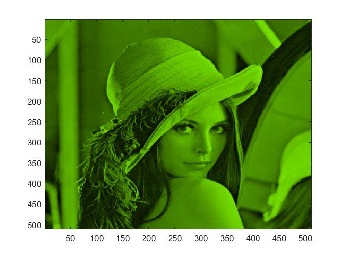

# wavelength-to-rgb
A matlab version of code to convert wavelength to rgb, toghter with colormap setting in matlab.

### Example

Suppose you are dealing with a figure of 541nm wavelength. 

```matlab
I = imread('lena.jpg');
imagesc(I);
rgb = wavelen2rgb(541);
mycolormap(rgb);
```

And this gives you




### Notes

The algorithm is based on [Dan Bruton's work](http://www.physics.sfasu.edu/astro/color/spectra.html).  

The code of `wavelen2rgb.m` is ported from python version of [rsmith-nl](https://github.com/rsmith-nl/wavelength_to_rgb).